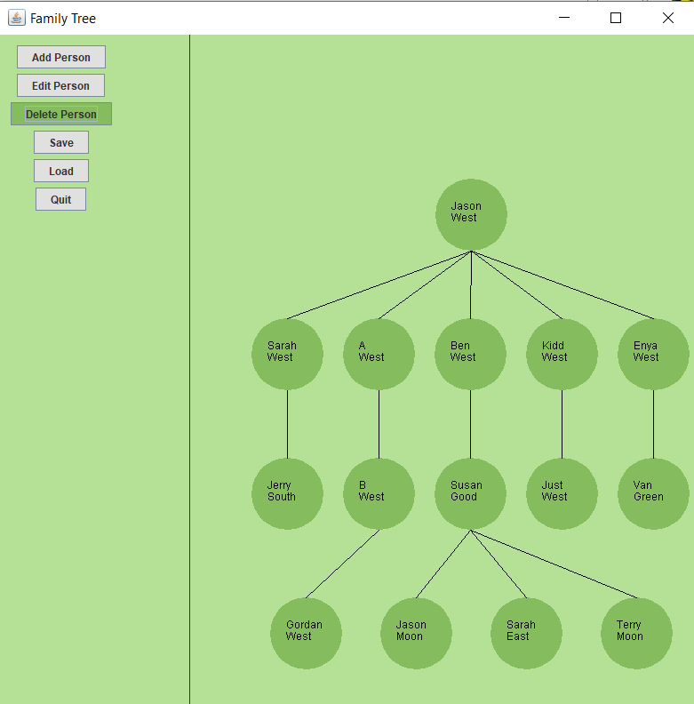

# Family_Tree
Family Tree using a Tree of ArrayLists. There is no upper bound for children. Each node contains an ArrayList that stores its children. 

# Running
1. Run using NetBeans IDE 7.4.

# Status
Completed:
The Add, Delete, and Edit functionalities are working as intended for Family Tree. Working on saving and loading (works with scaling bug). 
Binary Search Tree data structure working. GUI works with a few bugs.

Working:
Binary Search Tree scaling goes off screen requiring manual window increase. Will implement checker to see if tree is a complete, balanced, perfect and/or degenerate tree. Check valid inputs.

# Screens

