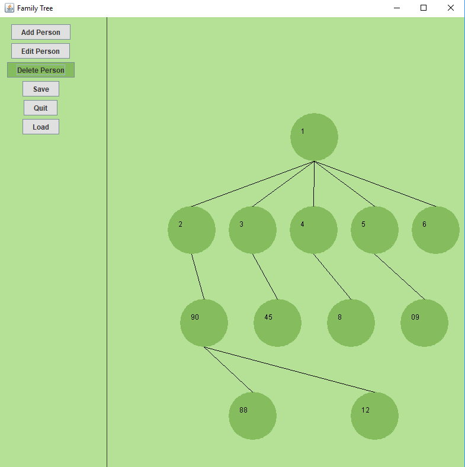
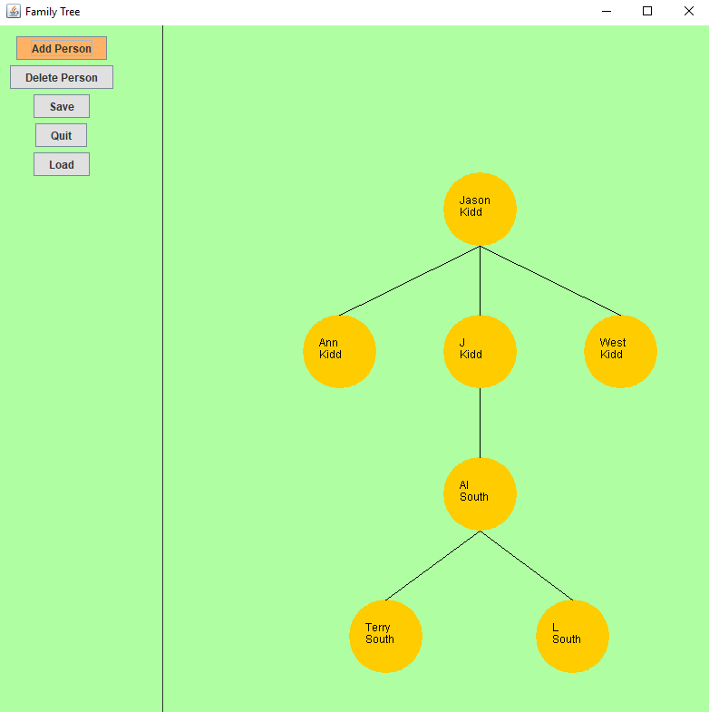

# Family_Tree
Family Tree using a Tree of ArrayLists. There is no upper bound for children. Each node contains an ArrayList that stores its children. 

# Status
The Add and Delete functionalities seem to be working as intended. The Edit function is currently being developed. Improving the UI and adding save and load functionalities will be implemented in the future. 

# Screen

