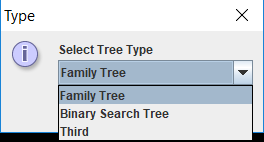
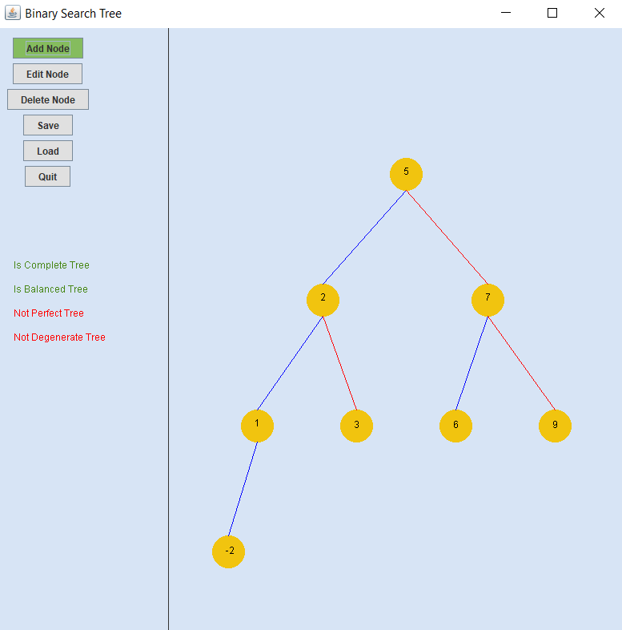
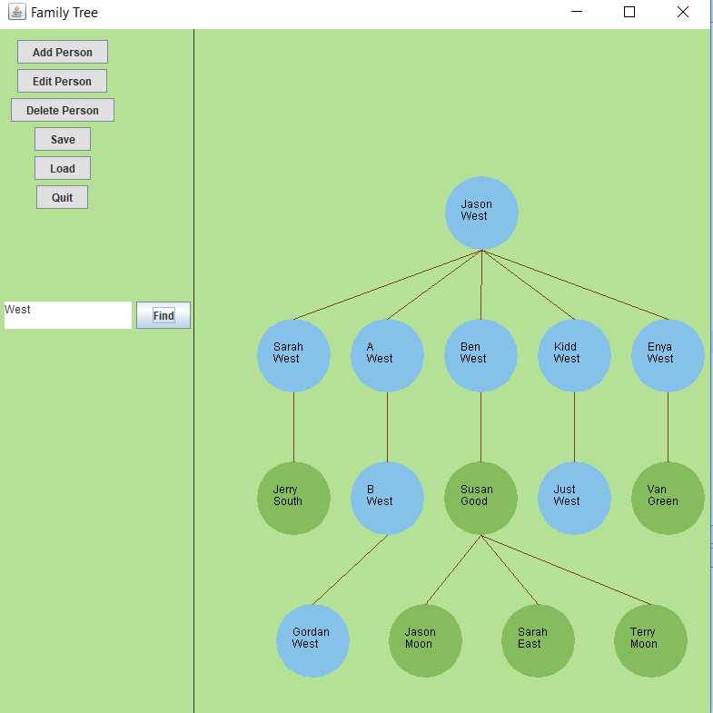

# Family_Tree
Family Tree using a Tree of ArrayLists. There is no upper bound for children. Each node contains an ArrayList that stores its children. 

# Running
1. Run using NetBeans IDE 7.4.

# Status
Completed:
The Add, Delete, and Edit functionalities are working as intended for Family Tree. 
Binary Search Tree data structure working. GUI works with a few bugs. Checker working to determine if tree is a complete, balanced, perfect and/or degenerate tree.

Working:
Working on saving and loading for Family Tree (works with scaling bug).
Fixing scaling issues for Binary Tree. Plan to add a balance button to Binary Search Tree GUI.

Bugs:
At greater depths, left nodes face the wrong way. Scaling goes off screen requiring manual window increase. 3 digit integers are not centered properly.

# Screens

