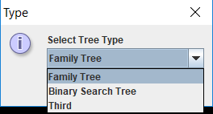
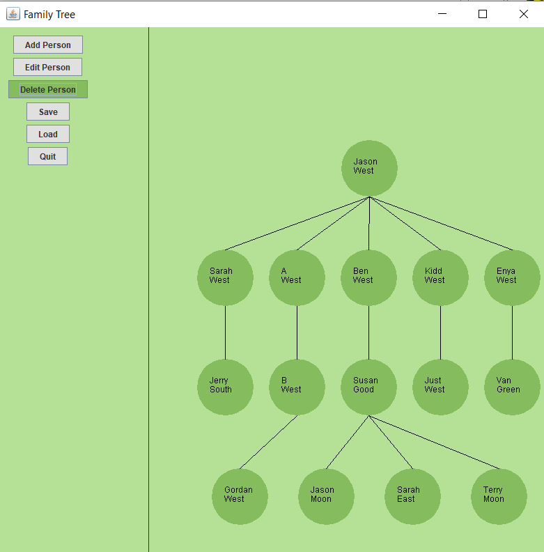
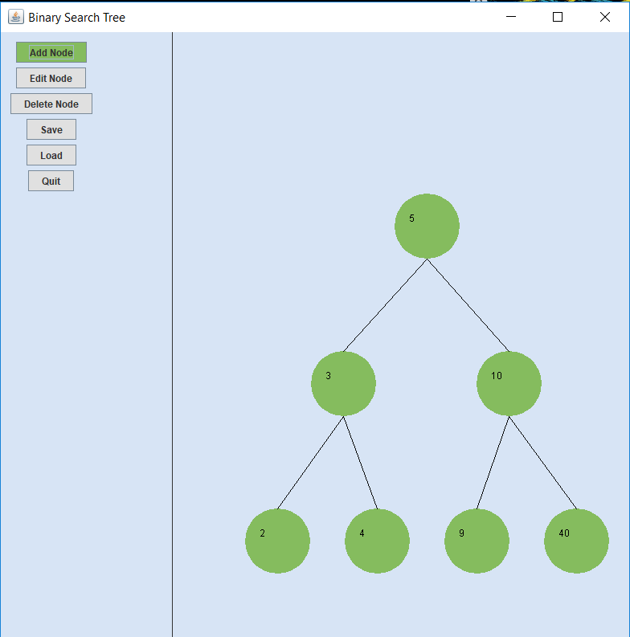

# Family_Tree
Family Tree using a Tree of ArrayLists. There is no upper bound for children. Each node contains an ArrayList that stores its children. 

# Running
1. Run using NetBeans IDE 7.4.

# Status
The Add, Delete, and Edit functionalities are working as intended. Working on saving and loading. 

Integrating Binary Search Tree option. Binary Search Tree data structure working. GUI still has some bugs (working on).

# Screens

